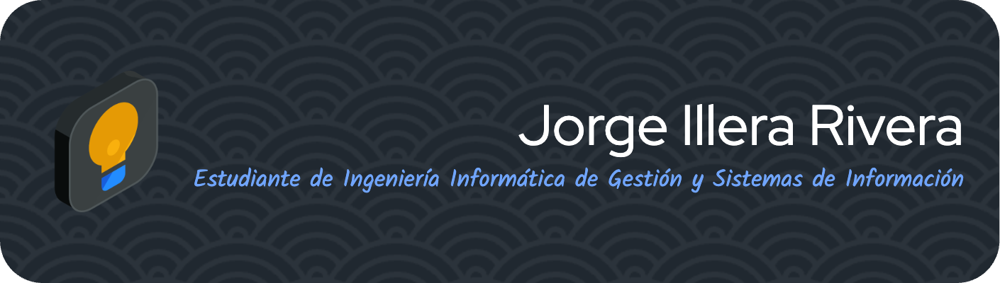

<h2 align="center">👋 ¡Hola, soy JORGE!</h2>
 

  🎓 Estudiante de Ingeniería Informática de Gestión y Sistemas de Información 
  🤖 Apasionado por la Inteligencia Artificial y el Machine Learning 
  🚀 Siempre aprendiendo y explorando nuevas tecnologías

---

### 🛠️ Tecnologías y herramientas

  
  
  
  
  
  
  
  

---

### 📈 Estadísticas de GitHub

  

  

---

  📫 <strong>Contacto:</strong> 
   
  

---

  

